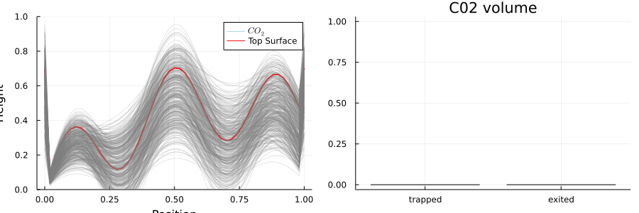

# SpillpointPOMDP.jl
Markov decision process formulation of CCS using a spillpoint forward model. Summarized with results in our [NeurIPS workshop paper](https://arxiv.org/abs/2212.00669). The POMDP is encapsulated by the struct `SpillpointInjectionPOMDP`.



## POMDP Specification

* `Δt = .1` - Time between steps
* `drill_locations = collect(0.1:0.1:0.9)` - Allowed drill locations for injector
* `injection_rates = [0.01, 0.07]` - Allowed rates of injection
* `obs_configurations =[collect(0.25:0.25:0.75), collect(0.125:0.125:0.875)]` - Allowed configurations for observation
* `obs_rewards = [-.3, -.7]` - Reward (cost) of each observation configuration
* `height_noise_std = 0.1` - Std deviation of noise on measurement of height of CO2
* `sat_noise_std = 0.02` - Std deviation of noise on measurement of "thickness" of CO2
* `exited_reward_amount = -10000` - Reward (cost) for each unit of leaked CO2
* `exited_reward_binary = -10` - One-time reward (cost) of having leakage
* `trapped_reward = 100` - Reward per unit of trapped CO2
* `s0_dist = SubsurfaceDistribution()` - Initial state distribution
* `γ = 0.9` - Discount factor


## States

The state is represented by the struct `SpillpointInjectionState` with the following parameters.

* `m::SpillpointMesh` - The description of the reservoir cap rock
* `x_inj` - The injector location
* `sr` - The spill region index of the injector (this is automatically computed)
* `polys` - The polygons that represent the trapped C02
* `v_trapped` - The total trapped volume of C02
* `v_exited` - The total exited volume of C02
* `stop` - Whether or not to stop injecting

## Actions

Actions take the following form
* `(:inject, val)` - Set the injection rate to `val`
* `(:observe, locs)` - Setup sensors at `locs`
* `(:stop, nothing)` - Stop injecting (end the episode)

The available injection rates and observation locations can be set in the `SpillpointInjectionPOMDP` using the parameters shown above. 


## Observations

There are two "leak" sensors on either side of the reservoir that return a `1` if  leakage is detected and a `0` otherwise. These observations are noiseless and are always included regardless of the action. When a well is drilled, a low-noise measurement of the reservoir top surface height is observed. If the `:observe` action is used followed by a vector locations, then the observation will additionally  consist of 2 numbers per location: a noisy measurement of the top surface height of the CO2 plume and a noisy measurement of its thickness. If no CO2 is present then values of `0` are returned for both measurement, providing no additional information as to the geometry of the top surface. The standard deviation of the noise of the measurements is specified in the POMDP


## Reward Function

The reward function is given by the expression
```
pomdp.exited_reward_amount*Δexited + pomdp.trapped_reward*Δtrapped + obs_reward + exited_penalty

```
where the reward parameters are set in `SpillpointInjectionPOMDP`. The `Δ` volumes are computed as the difference between states and `obs_reward` is calculated based on the observation configuration if the action is `:observe`.

## Belief Updating
We provide an implementation of sequential importance resampling for the belief update. The code for this can be found in `src/sir_particle_filter.jl`


Maintained by Anthony Corso (acorso@stanford.edu)
