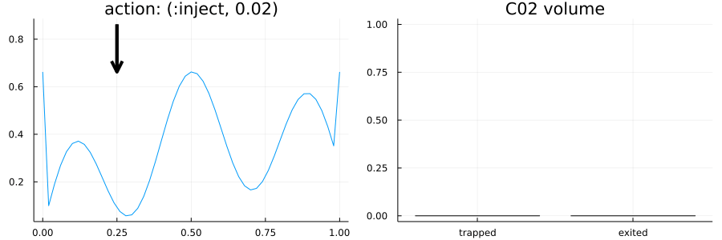

# SpillpointAnalysis.jl
Markov decision process formulation of CCS using a spillpoint forward model. The POMDP is encapsulated by the struct `SpillpointInjectionPOMDP`.



## POMDP Specification


## States

The state is represented by the struct `SpillpointInjectionState` with the following parameters.

* `m::SpillpointMesh` - The description of the reservoir cap rock
* `x_inj` - The injector location location
* `sr` - The spill region index of the injector (this is automatically computed)
* `polys` - The polygons that represent the trapped C02
* `v_trapped` - The total trapped volume of C02
* `v_exited` - The total exited volume of C02
* `injection_rate` - Current injection rate
* `obs_wells` - The observation wells
* `stop` - Whether or not to stop injecting

## Actions

Actions take the following form
* `(:inject, val)` - Set the injection rate to `val`
* `(:observe, loc)` - Setup a sensor at `loc`
* `(:stop, nothing)` - Stop injecting

The available injection rates and observation locations can be set in the `SpillpointInjectionPOMDP` using the parameters (with defaults shown)
* `injection_rates = [0.005, 0.01, 0.02]`
* `obs_locations = collect(0:0.2:1)`


## Observations

There is one observation for each sensors placed. The sensors provide a noisy measurement of the amount of C02 directly below the sensor. The observation noise model is set in the `SpillpointInjectionPOMDP` using the parameter
* `obs_noise_std = 0.02`


## Reward Function

The reward function is given by the expression
```
pomdp.exited_reward*Δexited + pomdp.trapped_reward*Δtrapped + pomdp.obs_reward*new_well
```
where the reward parameters are set in `SpillpointInjectionPOMDP`. The `Δ` volumes are computed as the difference between states and `new_well` is true if the action is `:observe`.


Maintained by Anthony Corso (acorso@stanford.edu)
